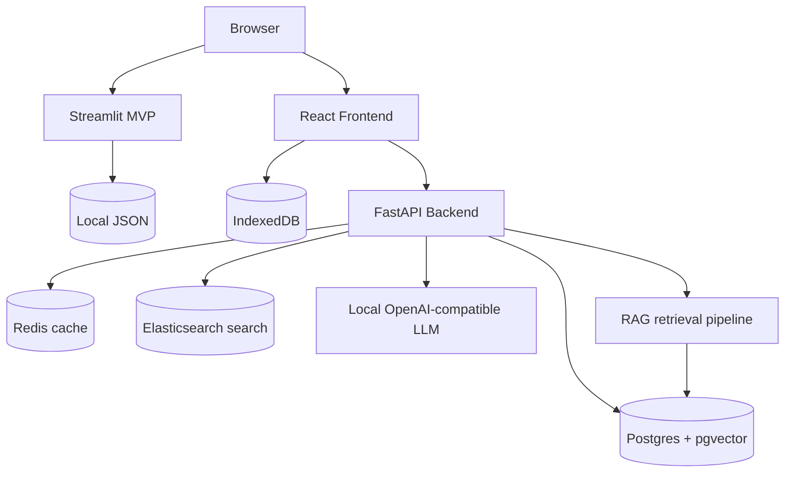

# Neurocognitive Mirror

A privacy-first cognitive self-tracking monorepo with two independent applications:

- `streamlit_mvp/`: zero-infrastructure Streamlit app for immediate Community Cloud deployment.
- `full_saas/`: local-first SaaS with React, FastAPI, PostgreSQL/pgvector, Redis, Elasticsearch, and a local OpenAI-compatible LLM service.

## Screenshots

> Placeholder: Dashboard screenshot

> Placeholder: Cognitive test screenshot

> Placeholder: AI narrative report screenshot

## Architecture



## Quickstart

### Streamlit MVP

```bash
cd streamlit_mvp
python -m venv .venv
source .venv/bin/activate
pip install -r requirements.txt
streamlit run app.py
```

### Full SaaS

```bash
cd full_saas
cp .env.example .env
docker compose up --build
```

Open:
- Frontend: http://localhost:5173
- Backend API docs: http://localhost:8000/docs
- LLM compatibility endpoint: http://localhost:8001/v1/chat/completions

## MVP vs Full SaaS

| Capability | Streamlit MVP | Full SaaS |
|---|---:|---:|
| Cognitive tests | Yes | Yes |
| Demo data | Yes | Yes |
| Local persistence | JSON + session | IndexedDB + optional sync |
| Backend analytics | In-process | FastAPI |
| RAG | Rule/context-lite | pgvector + sentence-transformers |
| LLM | Optional OpenAI-compatible | Local OpenAI-compatible service |
| Deployment | Streamlit Cloud | Docker Compose / local server |

## Privacy Philosophy

Neurocognitive Mirror treats cognition data as highly sensitive biometric-adjacent data. The system defaults to local storage, never stores raw cognitive event streams on the backend by default, supports anonymized aggregate analytics, and makes server sync opt-in.

## Roadmap

- Add additional validated tasks such as N-back and task switching.
- Add encrypted export bundles.
- Add clinician-facing local review mode.
- Add WebAuthn support.
- Expand RAG corpus with user-supplied papers.
