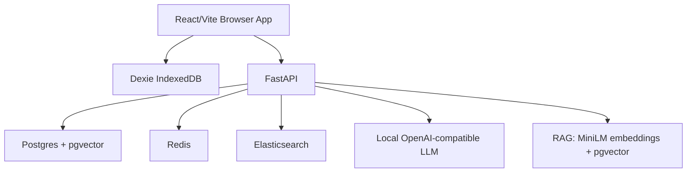

# Full SaaS

Production-grade local-first Neurocognitive Mirror platform.

## Setup

```bash
cp .env.example .env
docker compose up --build
```

## Run Locally Without Docker

Backend:
```bash
cd backend
pip install -r requirements.txt
uvicorn app.main:app --reload
```

Frontend:
```bash
cd frontend
npm install
npm run dev
```

## Environment Variables

See `.env.example`. Important variables: `DATABASE_URL`, `REDIS_URL`, `ELASTICSEARCH_URL`, `LLM_BASE_URL`, `JWT_SECRET`, `SYNC_ENABLED`.

## Deployment

Run with Docker Compose on a local workstation or private server. Mount persistent volumes for Postgres, Redis, Elasticsearch, and model cache. Use a reverse proxy with TLS for remote access.

## Architecture



## Model Download

The included `llm_service` is an OpenAI-compatible local shim that boots everywhere. For GPU inference, replace its image/command with vLLM:

```yaml
llm_service:
  image: vllm/vllm-openai:latest
  command: --model meta-llama/Meta-Llama-3-8B-Instruct --quantization bitsandbytes
  deploy:
    resources:
      reservations:
        devices:
          - capabilities: [gpu]
```

Authenticate to Hugging Face and accept model terms before downloading Llama 3.
