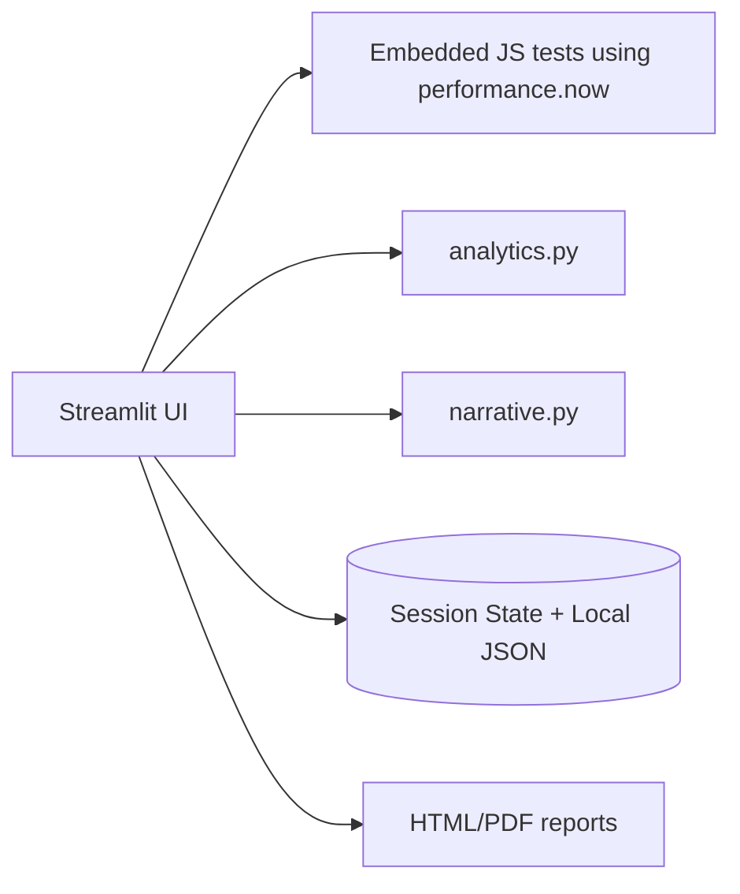

# Streamlit MVP

A zero-infrastructure cognitive self-tracking MVP deployable to Streamlit Community Cloud.

## Setup

```bash
python -m venv .venv
source .venv/bin/activate
pip install -r requirements.txt
```

## Run

```bash
streamlit run app.py
```

## Environment Variables

| Variable | Required | Purpose |
|---|---:|---|
| `OPENAI_BASE_URL` | No | OpenAI-compatible chat completions base URL. |
| `OPENAI_API_KEY` | No | API key for optional narrative generation. |
| `OPENAI_MODEL` | No | Model name, defaults to `gpt-4o-mini`. |
| `NCM_DATA_PATH` | No | Local JSON persistence path, defaults to `~/.neurocognitive_mirror_mvp.json`. |

## Deployment

Push this folder to GitHub and create a Streamlit Community Cloud app with `streamlit_mvp/app.py` as the entrypoint. Add optional OpenAI-compatible secrets in Streamlit Secrets or environment variables.

## Architecture


